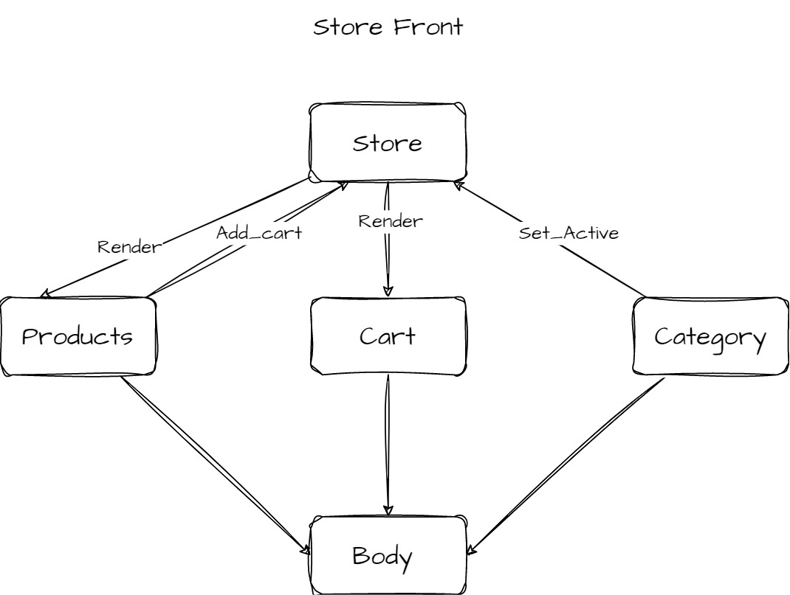

# StoreFront

Author:**Mohammad Attallah**

**Deploy :** [*DeployURL*](https://dapper-longma-5d01dd.netlify.app)

---

### **Description :** 

This project focuses on the development of the frontend for an online store. The frontend provides users with a web-based interface to interact with the store's products and categories. Users can browse through various product categories, view the items available in those categories, and add items to their shopping lists.  **`Redux`** is used for state management, ensuring data consistency and synchronization, while  **`React`** is employed to create the interactive and user-friendly web interfaces. 

### **Asynchronous**
In this app, data is fetched from the server without causing the app to freeze by using `Thunk`.

### **UML**

